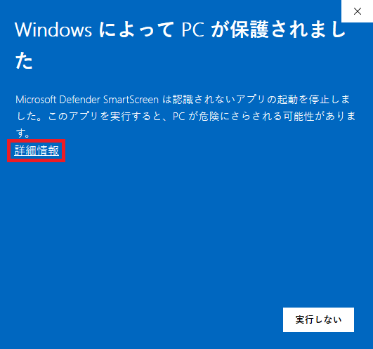
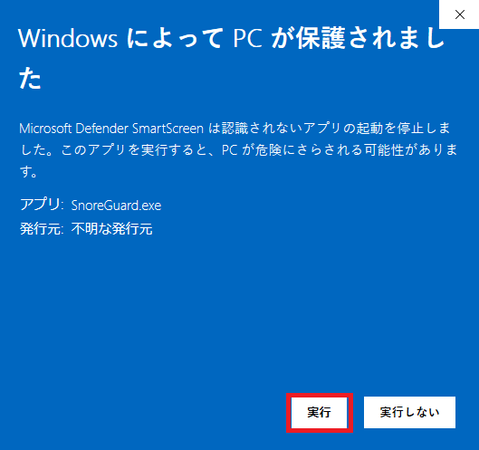
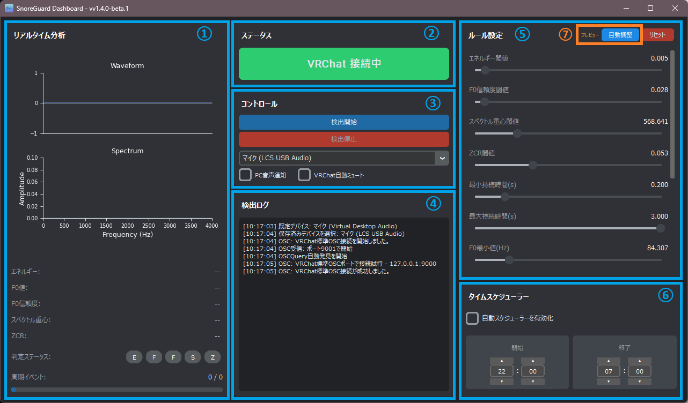
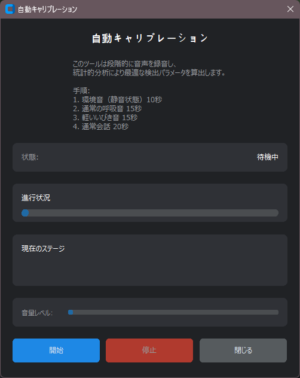
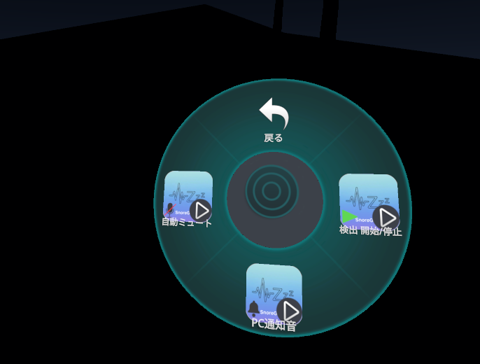

# SnoreGuard 説明書

### ■ 初回起動時の警告表示について

本ソフトウェアを初めて実行する際に、Windows Defender SmartScreenなどによって以下のような警告画面が表示されることがあります。

**「WindowsによってPCが保護されました」**

 
この警告メッセージは、OSのセキュリティ機能（Microsoft Defender SmartScreen）が、
新しく公開されたアプリケーションの安全性を確認するために表示するものです。
発行元の情報がシステムに十分に認知されていない場合、標準的な保護措置として表示されます。

**ご安心ください。本ファイルにウイルスなどの有害なプログラムは一切含まれておりません。**
開発の透明性を確保するため、本ソフトウェアの全ソースコードはGitHub上で公開しています。

お手数ですが、以下の手順で実行していただけますようお願いいたします。

1.  警告画面が表示されたら、**「詳細情報」**という文字のリンクをクリックします。

  

2.  画面が切り替わり、発行元やアプリ名が表示された下に**「実行」**というボタンが現れますので、そちらをクリックしてください。

  

この操作は通常、初回の起動時のみ必要となります。
ご不便をおかけいたしますが、ご理解いただけますと幸いです。

## 1. インストールと起動

1.  **[GitHubリリースページ](https://github.com/S-Akagi/SnoreGuard-py/releases)**から最新版のZIPファイルをダウンロードします。
2.  ダウンロードしたZIPファイルをPCのお好きな場所に展開（解凍）します。
3.  フォルダ内の`SnoreGuard.exe`をダブルクリックして起動します。

## 2. 画面構成

SnoreGuardの画面は、大きく分けて5つのセクションで構成されています。

  

### ① ステータスパネル

現在のSnoreGuardの全体的な状態を表示します。

* **システム待機中**: 検出が停止している状態です。
* **初期化中...**: 検出開始時に音声システムを準備している状態です。
* **検出中**: いびきの検出を実行している状態です。
* **イビキ検出!**: いびきを検出した直後の状態です。
* **VRChat 接続中/未接続**: VRChatとのOSC接続状態を表示します。

### ② コントロールパネル

SnoreGuardの基本的な操作を行います。

* **検出開始/停止ボタン**: いびき検出プロセスの開始と停止を切り替えます。
* **マイク選択**: 音声入力に使用するマイクデバイスを選択します。PCに接続されているマイクが一覧で表示されます。
* **PC音声通知**: チェックを入れると、いびき検出時にPCからビープ音が鳴ります。
* **VRChat自動ミュート**: チェックを入れると、いびき検出時にVRChat内のアバターを自動でミュートします。
* **自動調整**: 現在の環境に合わせてルール設定を自動的に最適化します。詳細は**[5. 自動調整機能](#5-自動調整機能-preview)**をご覧ください。
* **タイムスケジューラー**: 指定した時間帯のみ自動で検出を開始・停止できます。詳細は**[6. タイムスケジューラー](#6-タイムスケジューラー)**をご覧ください。

### ③ リアルタイム分析パネル

マイクから入力されている音声をリアルタイムで分析・表示します。

* **Waveform (波形)**: 音声の生の波形を表示します。オレンジ色でハイライトされる部分は、いびきの可能性があると判断された区間です。
* **Spectrum (スペクトラム)**: 音声の周波数成分を表示します。
* **詳細ステータス**: 現在の音声フレームから抽出された音響特徴量の値を表示します。
* **判定ステータス**: いびき判定ルールの各項目（エネルギー、F0信頼度など）が、現在のフレームで閾値をクリアしているか（パスしているか）をランプの色で示します。（緑: パス, 赤: フェイル）
* **周期イベント**: いびきと判断されるために必要な「候補イベント」が、設定された時間内に何回発生したかを表示します。プログレスバーは、時間ウィンドウの残り時間を示します。

### ④ 検出ログパネル

アプリケーションの動作ログを表示します。

* 検出の開始・停止
* いびきの検出イベント
* VRChatへの通知状況
* システムエラーなど

何か問題が発生した場合は、ここのログが原因究明の助けになります。

### ⑤ ルール設定パネル (詳細)

いびき検出エンジンの感度を細かく調整できます。設定を変更するとリアルタイムで分析に反映されるため、**判定ステータス**のランプの点灯具合を見ながら調整するのがおすすめです。

---

**【基本パラメータ】**

* **エネルギー閾値 (energy_threshold)**
    * **役割**: 音の大きさの基準値です。マイク入力の音量(RMS)がこの値を超えないと、分析が始まりません。 
    * **調整**:
        * **値を下げる**: より小さな音にも反応するようになり、検出感度が上がります。ただし、環境音やノイズを拾いやすくなる（誤検出が増える）可能性があります。
        * **値を上げる**: 大きな音にしか反応しなくなり、検出感度が下がります。環境音が大きい場合に誤検出を減らすのに有効です。

* **F0信頼度閾値 (f0_confidence_threshold)**
    * [cite_start]**役割**: 入力音が人の声のような周期的な音（有声音）であるかの確からしさの基準値です。 
    * **調整**:
        * **値を下げる**: 有声音と判定される基準が緩くなり、息っぽい音も拾いやすくなります。
        * **値を上げる**: はっきりとした声帯振動のある音に限定され、寝言などをいびきと誤検出しにくくなります。

* **スペクトル重心閾値 (spectral_centroid_threshold)**
    * [cite_start]**役割**: 音色の「明るさ」や「高さ」の基準値です。いびきは比較的低い周波数に特徴があるため、この値より低い重心を持つ音を候補とします。 
    * **調整**:
        * **値を下げる**: より低い音に限定され、高周波のノイズ（PCファン音など）を除外しやすくなります。
        * **値を上げる**: より高い音も候補に含めるようになり、高めのいびきに対応できる可能性がありますが、誤検出も増えやすくなります。

* **ZCR閾値 (zcr_threshold)**
    * [cite_start]**役割**: ゼロ交差率。波形がゼロラインを横切る頻度で、ノイズ成分の多さを示します。「サー」というようなホワイトノイズはZCRが高くなります。 
    * **調整**:
        * **値を下げる**: ノイズ成分が少ないクリアな音に限定します。
        * **値を上げる**: ノイズが多い音も候補に含めます。環境によっては感度向上に繋がりますが、通常は低めが推奨されます。

---

**【時間に関するパラメータ】**

* **最小/最大持続時間(s) (min/max_duration_seconds)**
    * [cite_start]**役割**: 上記の基本パラメータを全て満たした状態が、この秒数の範囲内に収まっているものを「いびき候補イベント」とします。 
    * **調整**: 「プッ」というような短すぎる音や、エアコンのような長すぎる連続音を除外するために使います。通常、変更の必要性は低いです。

* **F0最小/最大値(Hz) (f0_min_hz / f0_max_hz)**
    * [cite_start]**役割**: いびきとして認識する音の高さ（基本周波数）の範囲を指定します。 
    * **調整**: 一般的な成人男性のいびきはこの範囲に入ることが多いですが、声質によって調整が必要な場合があります。

---

**【周期性に関するパラメータ】**

* **周期イベント数 (periodicity_event_count)**
    * [cite_start]**役割**: いびきと最終判断するために必要な「いびき候補イベント」の回数です。 
    * **調整**:
        * **値を下げる**: より少ない回数で「いびき」と判断され、検出が速くなります。単発の咳などを誤検出する可能性が上がります。
        * **値を上げる**: より多くの回数が必要になり、誤検出は減りますが、連続的ないびきの開始を検知するのが少し遅れます。

* **周期ウィンドウ(s) (periodicity_window_seconds)**
    * [cite_start]**役割**: 上記の「周期イベント数」をカウントする時間の長さです。この秒数の間に指定回数のイベントが発生すれば検知となります。 
    * **調整**: いびきのリズムに合わせて調整します。通常はデフォルト値（45秒など）で十分機能します。

* **最小/最大イベント間隔(s) (min/max_event_interval_seconds)**
    * **役割**: 現在のバージョンでは、この設定は検出ロジックに直接使用されていません。  将来的な精度向上のための拡張用パラメータです。

---

### ⑥ タイムスケジューラ機能

指定した時間帯に自動でいびき検出を開始・停止する機能です。就寝時間に合わせて設定することで、手動操作なしで自動運用できます。

#### 設定方法
1. コントロールパネルで「タイムスケジューラー設定」を開きます。
2. **有効化**: チェックを入れてスケジューラーを有効にします。
3. **開始時刻**: 検出を自動開始する時刻を設定します（例：22:00）。
4. **終了時刻**: 検出を自動停止する時刻を設定します（例：06:00）。
5. 「適用」ボタンで設定を保存します。

#### 動作例
- 開始時刻 22:00、終了時刻 06:00 の場合：
  - 毎日22:00になると自動で検出開始
  - 翌日06:00になると自動で検出停止
  - 日跨ぎの設定にも対応

#### 注意事項
- スケジューラーは終了時刻まで継続して動作します。
- PCの電源が入っており、アプリが起動している必要があります。
- 手動での開始・停止も可能で、スケジューラーと並行して動作します。

### ⑦ 自動調整機能 

v1.4.0で追加された実験的機能です。あなたの環境に合わせてルール設定を自動的に最適化します。

#### 使用方法
1. 検出を停止した状態でコントロールパネルの「自動調整」ボタンをクリックします。
2. キャリブレーションモーダルが開きます。

  

1. 「開始」ボタンを押すと、約60秒間の音声収集が始まります。
2. 普通に話したり、軽い咳をしたり、いびきのような音を出してください。
3. 収集完了後、自動的に最適な設定が算出され、アプリに適用されます。

#### 注意事項
- プレビュー機能のため、結果が期待通りでない場合があります。
- 自動調整後も手動でのパラメータ調整は可能です。
- 環境が変わった場合（マイクを変更した、部屋を変えたなど）は、再度実行することを推奨します。

## 3. VRChat連携について

SnoreGuardは、VRChatが標準でサポートしている**OSC (Open Sound Control)** 機能を利用して、あなたのアバターをミュートします。

### VRChat側の設定

VRChatのAction Menuから `Options` > `OSC` を開き、`OSC`が`Enabled`になっていることを確認してください。

### 基本的な仕組み

SnoreGuardがいびきを検出すると、`127.0.0.1`（ローカルホスト）のポート`9000`に対して、VRChatの`/input/Voice`パラメータを操作するOSCメッセージを送信します。これにより、マイクのミュート状態が切り替わります。

  

## 4. トラブルシューティング

### Q. マイクがリストに表示されません。

* マイクがPCに正しく接続され、Windowsのサウンド設定で有効になっているか確認してください。
* アプリケーションを再起動してみてください。

### Q. VRChatでミュートされません。

* VRChatのOSCが有効になっているか確認してください（上記参照）。
* SnoreGuardの「VRChat自動ミュート」にチェックが入っているか確認してください。
* ファイアウォールやセキュリティソフトが、SnoreGuard (`SnoreGuard.exe`) やVRChatの通信をブロックしていないか確認してください。
* ステータスパネルが「VRChat 未接続」と表示されている場合、VRChatが起動していないか、OSCサービスが正常に動作していない可能性があります。

### Q. いびきをかいていないのにミュートされます (誤検出)。

* 「ルール設定」パネルで、以下のパラメータを少しずつ調整してみてください。
    * **エネルギー閾値**を少し上げる。
    * **周期イベント数**を1つ増やす。

### Q. いびきをかいているのにミュートされません (検出漏れ)。

* 「ルール設定」パネルで、以下のパラメータを少しずつ調整してみてください。
    * **エネルギー閾値**を少し下げる。
    * **周期イベント数**を1つ減らす。